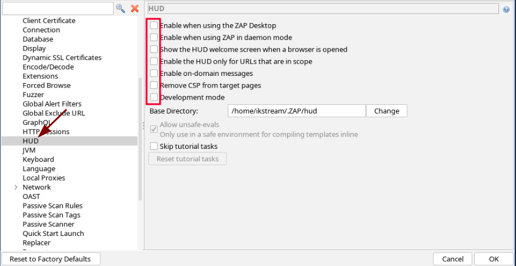
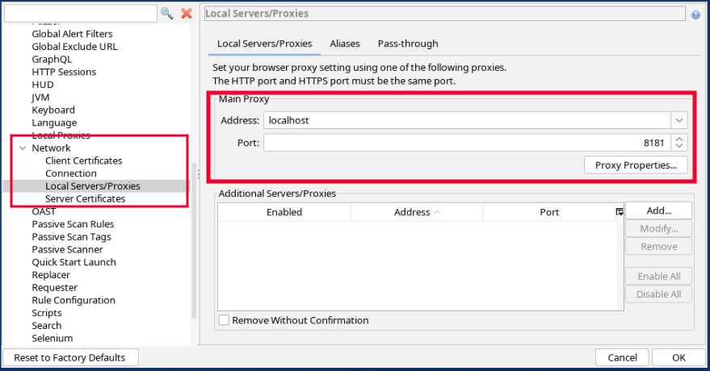
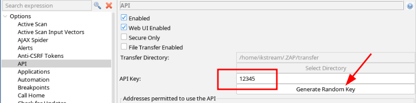

During Penetration tests I want to get out the boring stuff as fast and automated as possible to have more time for the fun stuff.
One of these things are vulnerable JavaScript libraries.
They don't always affect the site in question, but might be relevant nevertheless.

When I scan with `nmap` I usually use the `-oX` or `-oA` flag to generate XML files as output. These can be reused for multiple tools that allow further processing.

One of these tools is `eyewitness`. It takes screenshots of websites and can list things like default credentials for some sites it has in it's database.
By using the `-x` flag you can tell it to process XML files for detected web servers. 
Two additional options are `--proxy-ip` and `--proxy-port` where you can define a proxy that you want to route your eyewitness traffic through. 

That proxy should be [Zed Attack Proxy](https://www.zaproxy.org/)(ZAP/ZAProxy). While I prefer Burp for web assignments, ZAPs alert export function comes in handy on assignments with a higher amount of web servers like network infrastructure tests. The results (so called alerts) can be exported in JSON format and it has a plugin for vulnerable JavaScript components.

The export contains all the alerts ZAP detected, which might be quite a lot. 
So I wrote a tool to process the JSON report and extract some data from it, especially the vulnerable JavaScript components alert. I called it [zapalyzer ](https://github.com/ikstream/zapalyzer). 
The actual pipeline can be seen in the image below.

After we got the theory behind us, here is what you actually need to run.
## How to setup and run
As prerequisite we need a service scan file from nmap, preferably run with the `--version-all` flag.
### Proxy setup
We need to setup ZAProxy first. If your distro provides it as a package install it from there.

**Blackarch**
```sh
sudo pacman -S zaproxy
```

**Kali**
```sh
sudo apt install zaproxy
```

If it's not provided by your distro, you can either use a container or install it on your system following the instructions in the [ZAP documentation](https://www.zaproxy.org/getting-started/#install-and-configure-zap) 

Make sure you install the plugins you want to use. In our case this would be the `Retire.js` plugin. Or install them all, if you want to. For me, it is already installed, so I just need to check for updates.

Go to the options menu (`Tools->Options`) and disable the ZAP HUD. Otherwise it might show up in some of the screenshots taken by eyewitness.



Next we want to check, that the proxy server is running on a port we actually want it to run. As I have 8080 configured and usually in use by Burp, I will change it to 8181, but every unused port will do.



### eyewitness
Start [eyewitness](https://github.com/RedSiege/EyeWitness) with the service scan XML file and use the ZAProxy.
```sh
eyewitness -x service-scan.xml --proxy-ip 127.0.0.0.1 --proxy-port 8181 --delay 15 --timeout 25 --no-prompt
```

1. In addition I added a delay before taking a screenshot of 15 seconds and increased the timeout to 25 seconds before eyewitness will close the connection and report the site with an error. The `--no-prompt` flag will prevent eyewitness from asking you if it should open the resulting `report.html` file.
### extract alerts
To export the report we need to use the API. The GUI report is structured in a different way. If you want to process the GUI report as well, feel free to open a PR.

By default most API access requires an API key. It can be set in the `API` section in `Options`. Use the randomly generated API key or use a strong one. For this article I assigned `12345` to keep it simple and recognisable.



To get the report we can use curl and the API key. The following command will get the report from my instance of ZAP.
```sh
curl 'http://localhost:8181/JSON/alert/view/alerts/?apikey=12345'
```

To improve readability, if you want to skim over the report by yourself we can add the Python `json` module in-between

```sh
curl 'http://localhost:8181/JSON/alert/view/alerts/?apikey=12345' | python -m json.tool | tee zap-alert-report.json
```

`python -m json.tool` will output the minimized alert report in a way that's easier to read for humans. `zapalyzer` can work with the minimized and the table out as well. And you can always pipe the report though python later.

`tee` will write the processed report to the `zap-alert-report.json` file, as well as to `stdout`.

### process alerts
Now we can clone the `zapalyzer` repository and process the report for JavaScript vulnerabilities.
```sh
git clone https://github.com/ikstream/zapalyzer
cd zapalyzer 
```

```sh
zapalyzer -i <path/to/ZAProxy-report-file>
```

Let's assume we have run the `curl` command from the directory above `zapalyzer`, we can use the following command.

```sh
zapalyzer -i ../zap.json --csv 
```

This will print all detected vulnerable JavaScript libraries to `stdout` including it's Caves (if available) or just EoL if they reached end of live state.
From here on, we can redirect the output to a file again with `tee` as we have seen above, or with the redirection operators `>` or `>>`.

In addtition, zapalyzer can retrieve the CVSS Base Score and the CVSS vector of a CVE found in the alert output. Therefore the `--cve` flag needs to be set. This data is fetched from  [NIST's NVD database](https://nvd.nist.gov/)
```sh
zapalyzer -i ../zap.json --csv --cve
```
If you get an API key from NVD you can speed up the process of retrieving CVE related data. Without an API key the numbers of requests allowed is very limited. You can request one [here](https://nvd.nist.gov/developers/request-an-api-key).

One last thing to mention though: just because a vulnerable JavaScript library is present, it doesn't mean that the application is vulnerable per se. 

Thanks for reading and maybe even using zapalyzer. If you are missing a feature, just open a pull request or an issue at [GitHub](https://github.com/ikstream/zapalyzer).

## Bonus - working with a socks proxy
If you need to send all the request through some machine in the client's network, you can configure ZAProxy to use a Socks proxy.

Therefore you need open a Socks connection first, e.g. using ssh.
```sh
ssh <username>@<host> -D <port-you-want-to-use>
```
For a system in a local network this could look like the following.
```sh
ssh test@10.10.10.2 -D 9191
```
Now you need to configure ZAProxy to use port`9191`.


## Bonus working with a headless zaproxy
You can also run the zaproxy headless (without the GUI Interface)from the CLI and collect data as normal.


```sh
zaproxy -daemon -config api.key="UseAGood1" -newsession ~/<your-data-directory>/<session-name> -addoninstallall -addonupdate
```

If you really don't want to work with an API key, you can disable it from the cli as well.
```sh
-config api.disablekey=true
```

You can also continue previous zap sessions.

```sh
zaproxy -daemon -config api.disablekey=true -session ~/<your-data-directory>/
```

There are also more commandline options available to configure ZAP to your needs. [Check their documentation](https://www.zaproxy.org/docs/desktop/cmdline/)

## References

- [Zed Attack Proxy](https://www.zaproxy.org/)
- [eyewitness](https://github.com/RedSiege/EyeWitness)
- [ZAP command line options](https://www.zaproxy.org/docs/desktop/cmdline/)
- [NIST's NVD database](https://nvd.nist.gov/)
- [Request an NIST NVD API key](https://nvd.nist.gov/developers/request-an-api-key)
- [zapalyzer](https://github.com/ikstream/zapalyzer)
